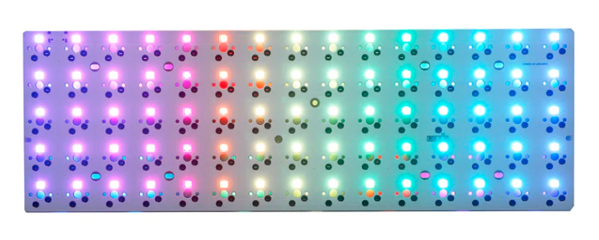
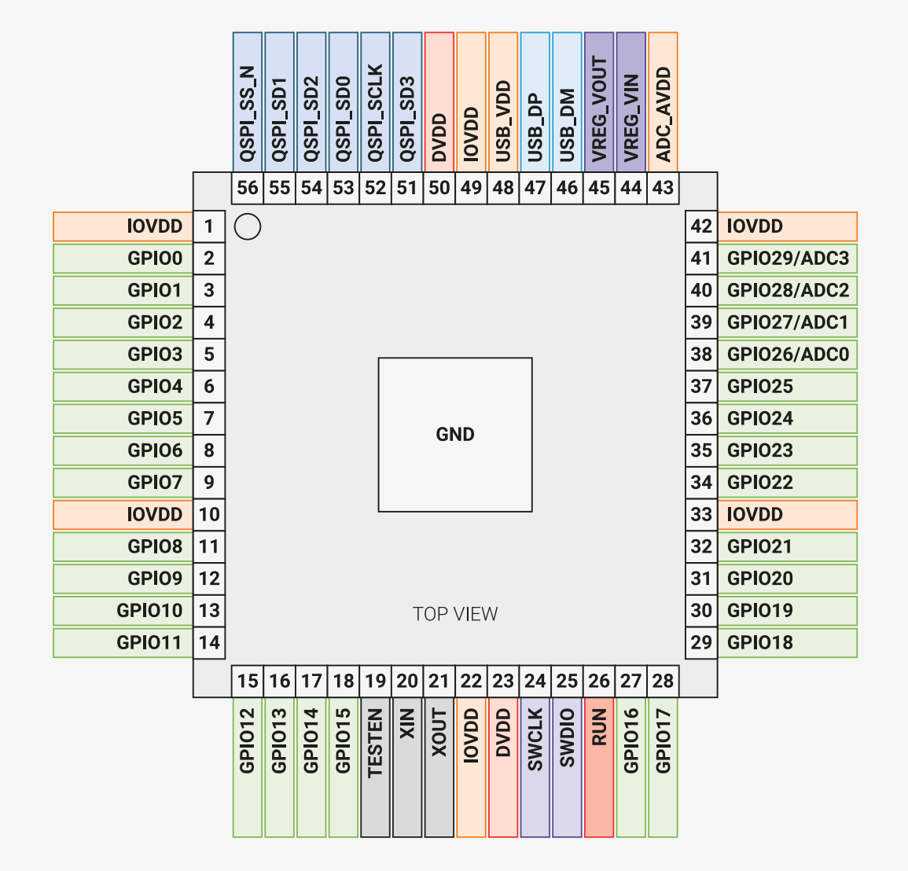

# YMDK ID75

[Store Link](https://ymdkey.com/products/id75-idobe-75-hotswap-pcb-aluminum-plate?variant=41429576450109)

## Pinout

Grabbed this from both visual and experimental examination of the board,
so any unlabeled pins may actually have a function

Direction: C2R

| Type       |  Pin # | Function |     | Comment                                                               |
|------------|--------|----------|-----|-----------------------------------------------------------------------|
| GPIO/ADC   |  26/0  | in:  C0  | in  |                                                                       |
| GPIO/ADC   |  27/1  | in:  C1  | in  |                                                                       |
| GPIO       |  4     | in:  C2  | in  |                                                                       |
| GPIO       |  5     | in:  C3  | in  |                                                                       |
| GPIO       |  1     | in:  C4  | in  |                                                                       |
| GPIO       |  23    | in:  C5  | in  |                                                                       |
| GPIO       |  22    | in:  C6  | in  |                                                                       |
| GPIO       |  21    | in:  C7  | in  |                                                                       |
| GPIO/ADC   |  28/2  | in:  C8  | in  |                                                                       |
| GPIO       |  3     | in:  C9  | in  |                                                                       |
| GPIO       |  7     | in:  C10 | in  |                                                                       |
| GPIO       |  12    | in:  C11 | in  |                                                                       |
| GPIO       |  13    | in:  C12 | in  |                                                                       |
| GPIO       |  14    | in:  C13 | in  |                                                                       |
| GPIO       |  15    | in:  C14 | in  |                                                                       |
| GPIO       |  8     | out: R0  | out |                                                                       |
| GPIO       |  6     | out: R1  | out |                                                                       |   
| GPIO       |  19    | out: R2  | out |                                                                       | 
| GPIO       |  20    | out: R3  | out |                                                                       |
| GPIO       |  18    | out: R4  | out |                                                                       |
| GPIO       |  2     | Key LEDs |     | from lower right corner, leftward on each row to the top right corner ||

